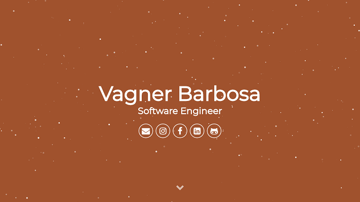

# vagnerbarbosa.github.io

[](https://jekyllrb.com/)
[](https://vagnerbarbosa.github.io)
[](LICENSE)

> Personal website and portfolio of Vagner Barbosa - Software Engineer



## Objetivo

Este repositório contém o código-fonte do meu site pessoal e portfólio profissional, desenvolvido para apresentar minha experiência como Software Engineer, as tecnologias que domino e minha trajetória na área de TI desde 2012.

O site tem como objetivos:
- **Apresentação profissional**: Compartilhar minha experiência e background técnico
- **Portfólio de tecnologias**: Demonstrar as stacks que trabalho (Java, Kotlin, Go, e mais)
- **Contato**: Facilitar a conexão com recrutadores e outros profissionais da área
- **Presença online**: Manter uma presença digital atualizada e profissional

## Tecnologias

### Core
| Tecnologia | Versão | Descrição |
|------------|--------|-----------|
| [Jekyll](https://jekyllrb.com/) | 4.x | Gerador de sites estáticos |
| [Ruby](https://www.ruby-lang.org/) | 3.2+ | Linguagem base do Jekyll |
| [Node.js](https://nodejs.org/) | 20.x | Ambiente de execução para build tools |

### Frontend
| Tecnologia | Uso |
|------------|-----|
| HTML5 | Estrutura semântica |
| SCSS/Sass | Estilização avançada |
| JavaScript | Interatividade e animações |
| [Particles.js](https://vincentgarreau.com/particles.js/) | Animação de partículas no header |
| [Sweet Scroll](https://tsuyoshiwada.github.io/sweet-scroll/) | Navegação suave |

### Build Tools
| Tecnologia | Função |
|------------|--------|
| [Gulp](https://gulpjs.com/) | Task runner para automação |
| gulp-sass | Compilação SCSS |
| gulp-uglify | Minificação de JS |
| gulp-csso | Minificação de CSS |
| gulp-imagemin | Otimização de imagens |
| browser-sync | Live reload durante desenvolvimento |

### Deploy
- **GitHub Pages**: Hospedagem gratuita integrada ao GitHub
- **Domínio customizado**: Configurado via CNAME

## Estrutura do Projeto

```
vagnerbarbosa.github.io/
├── _config.yml              # Configuração do Jekyll
├── _includes/               # Componentes reutilizáveis
│   ├── about.html          # Seção de tecnologias
│   ├── comments.html       # Sistema de comentários
│   ├── footer.html         # Rodapé com scripts
│   ├── google-analytics.html
│   ├── head.html           # Meta tags e CSS
│   └── header.html         # Hero section
├── _layouts/                # Templates de página
│   ├── default.html        # Layout principal
│   ├── page.html           # Layout para páginas
│   └── post.html           # Layout para posts
├── _sass/                   # Estilos Sass do Jekyll
├── assets/                  # Assets compilados
│   ├── css/main.css        # CSS final
│   ├── js/                 # JavaScript
│   ├── fonts/              # Ícones (FontAwesome, Devicon)
│   └── favicon.png
├── src/                     # Arquivos fonte
│   ├── styles/             # SCSS source
│   │   ├── _about.scss
│   │   ├── _header.scss
│   │   ├── _footer.scss
│   │   └── main.scss
│   ├── js/                 # JavaScript source
│   └── fonts/              # Fontes source
├── gulpfile.js             # Configuração do Gulp
├── Gemfile                 # Dependências Ruby
├── package.json            # Dependências Node.js
├── index.html              # Página inicial
├── about.md                # Página sobre
├── header.png              # Imagem de banner
├── CNAME                   # Configuração de domínio
└── README.md               # Este arquivo
```

## Desenvolvimento

### Pré-requisitos
- Ruby 3.2 ou superior
- Node.js 20.x ou superior
- Bundler (`gem install bundler`)

### Instalação

1. Clone o repositório:
```bash
git clone https://github.com/vagnerbarbosa/vagnerbarbosa.github.io.git
cd vagnerbarbosa.github.io
```

2. Instale as dependências Ruby:
```bash
bundle install
```

3. Instale as dependências Node.js:
```bash
npm install
```

### Comandos

| Comando | Descrição |
|---------|-----------|
| `bundle exec jekyll serve` | Inicia servidor de desenvolvimento |
| `gulp` | Executa build completo com minificação |
| `gulp watch` | Modo watch com live reload |

O site estará disponível em `http://localhost:4000`

## Configuração

### Site (`_config.yml`)
Edite as informações pessoais:

```yaml
username: Seu Nome
user_description: Sua descrição
user_title: Seu Título
email: seu@email.com
```

### Tecnologias (`_includes/about.html`)
Para atualizar as tecnologias exibidas, edite as seções:
- **Design**: Tecnologias de frontend/design
- **Code**: Linguagens de programação
- **Tools**: Ferramentas e plataformas

## Deploy

O deploy é automático via GitHub Pages:
1. Faça push para a branch `master`
2. O GitHub Pages irá buildar e publicar automaticamente
3. O site ficará disponível em `https://vagnerbarbosa.com`

## Personalização

### Cores
As cores principais são definidas em `src/styles/_vars.scss`:
- Cor primária: `#5B4282`
- Cor secundária: `#E44D26`
- Cor de destaque: `#00ACD7`

### Fontes
- [Font Awesome](https://fontawesome.com/) para ícones
- [Devicon](https://devicon.dev/) para ícones de tecnologia

## Licença

Este projeto está licenciado sob a licença MIT - veja o arquivo [LICENSE](LICENSE) para detalhes.

---

Desenvolvido com ❤ por Vagner Barbosa
